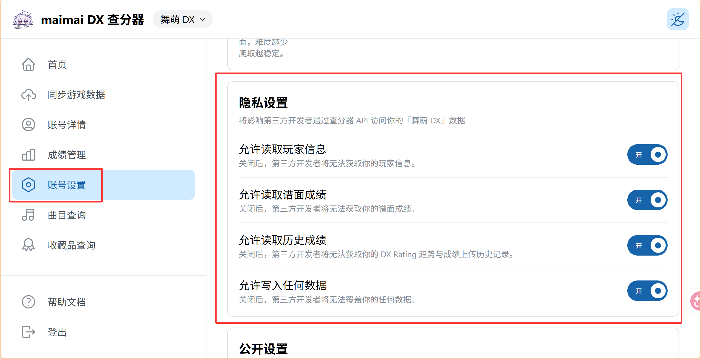
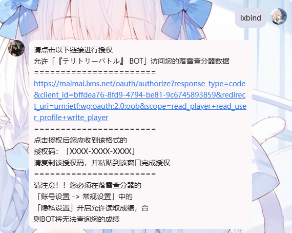
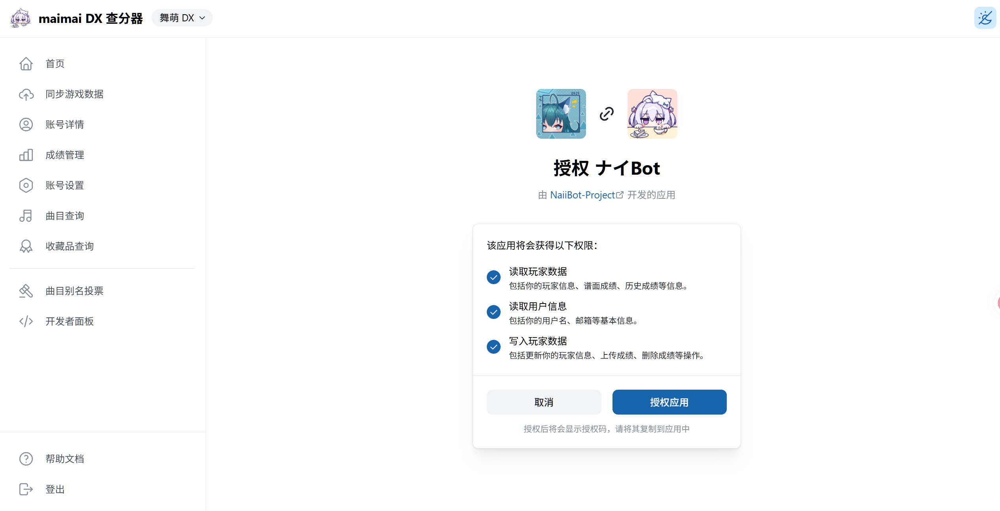
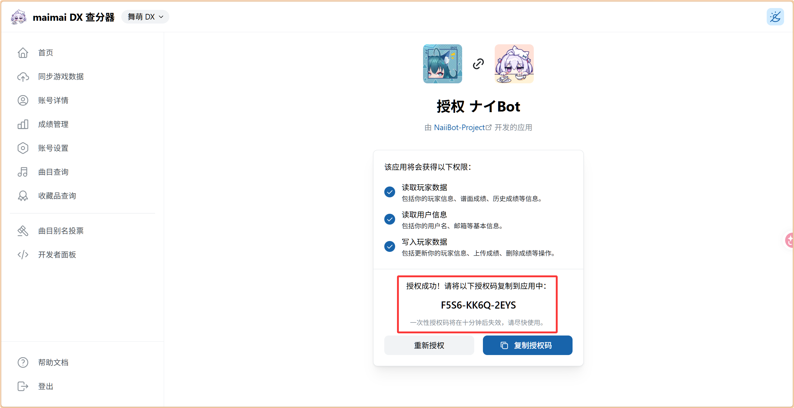
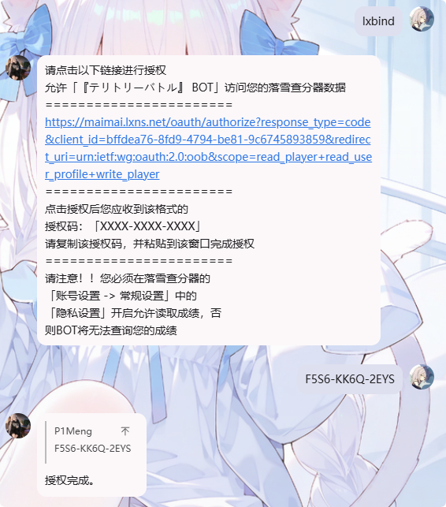
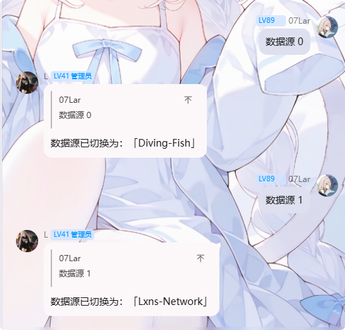
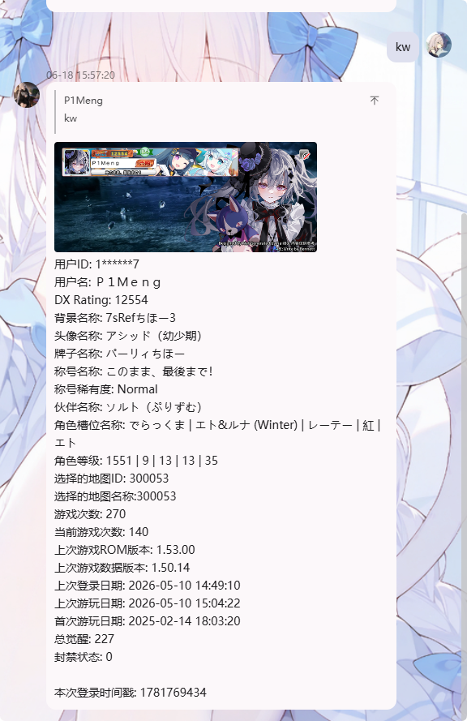

## 0x00 事先准备

1. [水鱼查分器](//maimai.diving-fish.com/) / [落雪查分器](https://maimai.lxns.net/) 账号 （任选其一，若没有先注册）
2. 进入奈伊群
> [!WARNING] 注意
> 奈伊群改为邀请制群聊，如有需要请找可能的群友拉你入群
3. 一个舞萌账号

## 0x01 绑定步骤

[绑定水鱼](#水鱼绑定) / [绑定落雪](#落雪绑定)

### 水鱼绑定

#### 水鱼Token获取

打开 [水鱼官网](//maimai.diving-fish.com/#Profile) ，如果没有水鱼账号，先注册一个账号

然后点击右上角的编辑个人资料

2. 找到NaiiBot，直接发起临时会话

3. 发送你在 [水鱼Token获取](#水鱼token获取) 中获取到的 `成绩导入Token`

> 使用 `tokenbind <水鱼Token>` 进行绑定

4. 从舞萌公众号获取二维码，然后长按识别二维码，长按全选识别到的内容

> 使用 `maibind <识别到的内容>` 进行绑定

[点我前往功能详情](#0x02-功能)

### 落雪绑定

1. 若没有落雪账号，可参考下面注册一个

[落雪查分器注册](https://maimai.lxns.net/register)

注册完后按照图示点击开启权限，否则将无法正常获取成绩和帮助导入成绩

2. 找到NaiiBot，直接发起临时会话

:::WARNING
**注意：** 直接点击头像私聊即可，无需加好友
:::

3. 发送 `lxbind` 获取绑定地址

然后打开这个链接，登录你刚刚注册的落雪账号

完成后应该来到这个界面，点击授权

授权成功后会得到一个授权码，将其复制

4. 直接将这个授权码发送到刚刚发送 `lxbind` 的地方

提示 `授权完成。` 即表示绑定成功

5. 从舞萌公众号获取二维码，然后长按识别二维码，长按全选识别到的内容

> 使用 `maibind <识别到的内容>` 进行绑定

## 0x02 功能

发送 `导` `syup` 可以将你的成绩直接上传到 水鱼 / 落雪 （若两个都绑定了，则会同时上传）

发送 `数据源 [0|1]` 按需切换数据源，0为水鱼，1为落雪

发送 `b50` 即可从查分器获取你的b50成绩，然后生成图片

发送 `kw` 获取详细个人数据

