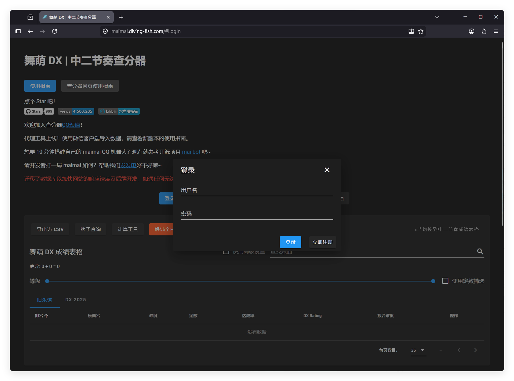
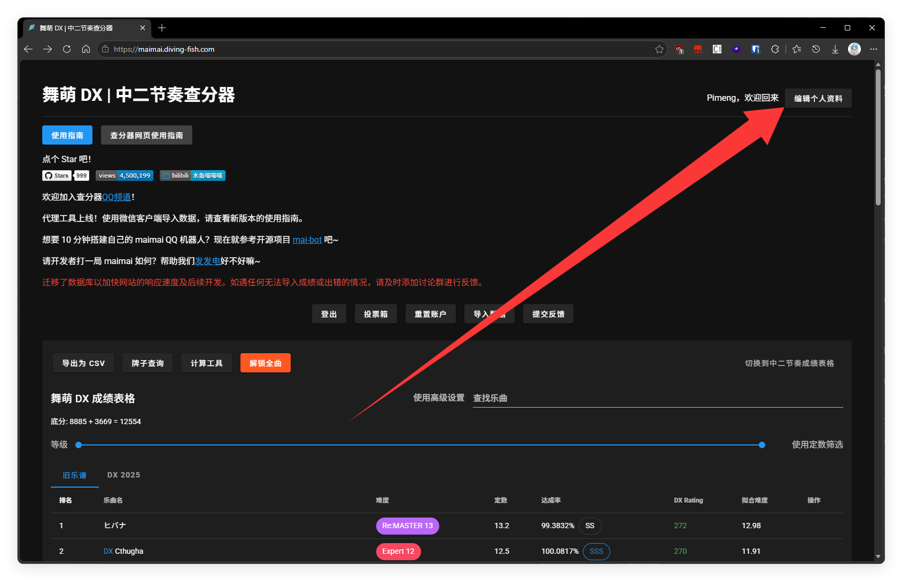
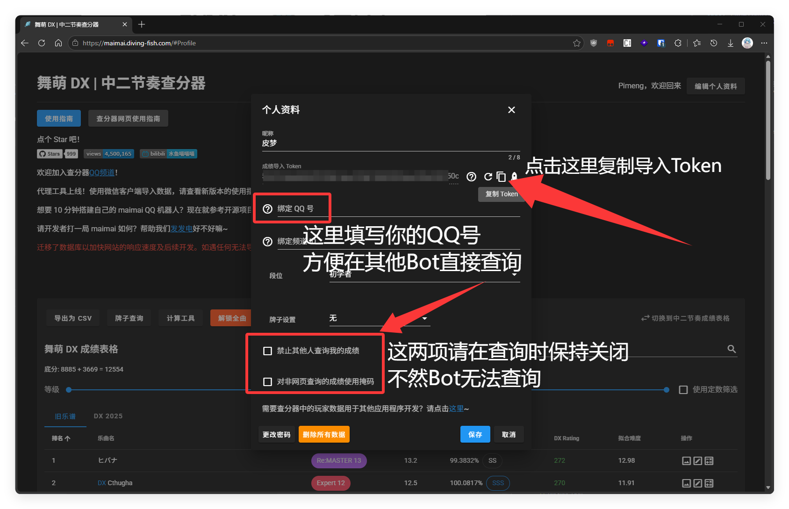
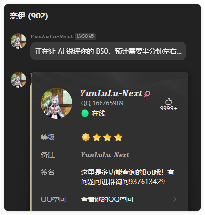
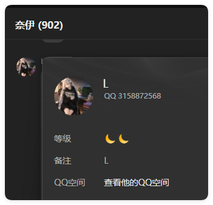
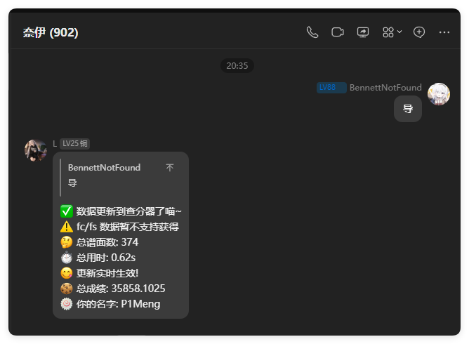

## 0x00 事先准备

1. [水鱼查分器](//maimai.diving-fish.com/) 账号（后续将弃用，使用落雪）
2. 进入奈伊群（群号747686616）
3. 一个舞萌账号

## 0x01 绑定步骤

### 水鱼Token获取

打开 [水鱼官网](//maimai.diving-fish.com/#Profile) ，如果没有水鱼账号，先注册一个账号

然后点击右上角的编辑个人资料

### 绑定奈伊Bot

1. 找到这俩Bot其一，直接发起临时会话

:::WARNING
**注意：** 直接点击头像私聊即可，无需加好友
:::

2. 发送你在 [水鱼Token获取](#水鱼token获取) 中获取到的 `成绩导入Token`

> 使用 `tokenbind <水鱼Token>` 进行绑定

3. 从舞萌公众号获取二维码，然后长按识别二维码，长按全选识别到的内容

> 使用 `maibind <识别到的内容>` 进行绑定

## 0x02 功能

发送 `导` `syup` 可以将你的成绩直接上传导水鱼

发送 `b50` 即可从水鱼获取你的b50成绩，然后生成图片
