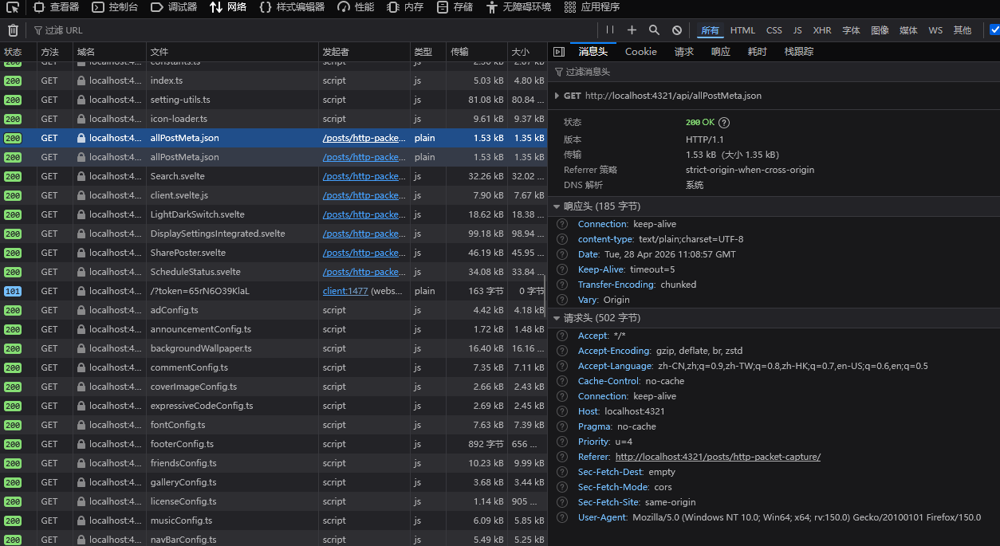

>  [!WARNING]
>  内容大部分由AI生成

## 0x00 前言

> [!note] 写在前面
> 这篇文章说的“抓包”，专指 **HTTP/HTTPS 抓包**。也就是看看 App、网页、小程序在访问服务器接口时，到底发了什么、收到了什么。
>
> 不包含更底层的 `TCP`、`UDP` 那些，也不研究数据包怎么拆分的——那些太硬核，咱们先不碰。

所谓抓包，说白了就是把客户端和服务器之间的“对话”偷偷记下来，让你能看到。

平时你打开一个网页、登录一个 App、点一下刷新、提交一个表单，背后其实都在发 HTTP 请求。这些请求里藏着很多信息：访问的地址是啥、用了什么方法、带了哪些参数、有没有带 Cookie、服务器返回了什么数据……抓包工具的作用，就是把这些原本藏在程序背后的东西翻出来给你看。

通过抓包，你能知道：

- 点这个按钮，到底调用了哪个接口？
- 发请求时带了哪些参数？
- 服务器返回了什么内容？
- 请求失败到底卡在哪一步？

> [!tip] 为什么要抓包？
> 因为很多时候，“页面上显示的错误提示”根本不说人话。比如只告诉你“网络错误”，但真实原因可能是 Token 过期、参数缺失、或者服务器返回了错误数据。抓包能让你看到真相。

对于开发人员来说，抓包可以调试接口、排查登录问题、分析参数传没传对、确认前后端数据是否一致。
对于普通学习者来说，抓包也能帮你搞明白浏览器、App 和服务器之间到底怎么“聊天”的。

举个例子：  
某个 App 弹窗说“网络错误”，你以为是没网了？其实可能是服务器拒绝了请求，或者你的登录凭证失效了。用抓包一看，哦，原来服务器返回了“401 未登录”。这一下就清楚了。

> [!warning] 注意
> 抓包只是观察和调试网络请求的一种手段。
> 请只在自己有权限的设备、账号、网站或测试环境中使用。别拿去偷看别人的隐私数据，这是底线。

所以，这篇文章不扯太深的原理，也不讲底层网络协议。  
我们就从最实用、最常见的 HTTP 抓包开始，看看它能干什么、怎么用，以及为什么很多人学着学着就“放弃”了。

## 0x01 HTTP 抓包是什么？

HTTP 抓包，本质上就是把一次“你看不见的后台网络请求”变成“你能读懂的聊天记录”。

没有抓包之前，你只能看到页面上的结果：

- 登录成功 / 登录失败
- 加载出来了 / 加载失败了
- 按钮点了没反应
- 提示“网络错误”

这些提示往往很模糊，就像有人只说“出错了”，但不说哪里错了。

而有了抓包，你就能看到完整的“聊天记录”。比如：

**客户端说：**
```
GET /api/user/profile HTTP/1.1
Host: example.com
Authorization: Bearer xxxxx
```

**服务器回答：**
```json
{
  "code": 401,
  "message": "token expired"
}
```

这样一来，“网络错误”就不再是个谜。你可以清楚地看到：

- 请求有没有发出去？
- 发到哪个地址去了？
- 参数带全了吗？
- Cookie 或 Token 还有效吗？
- 服务器返回了什么状态码？
- 返回的数据对不对？

> [!NOTE] 简单理解
> 抓包不是“黑进服务器”，而是把你电脑或手机和服务器之间的通信记录截下来给你看。
> 就像在电话线上装了个录音机，但前提是你有这个权利。

## 0x02 一次 HTTP 请求里通常有什么？

一次 HTTP 请求，就像你给一个人写信。信上有收件地址、你的名字、你要说的事情，还有附带的资料。

常见的几个部分：

- **请求地址（URL）**：就像收件地址，告诉服务器你要找谁。例如 `https://example.com/api/user`
- **请求方法**：你是去“拿东西”（GET），还是“交东西”（POST），或者“改东西”（PUT）、“删东西”（DELETE）
- **请求头（Headers）**：附带的说明，比如“我是用什么浏览器发起的”、“我带着什么 Token”
- **请求参数**：具体要问的内容。比如 `?id=10001` 表示“我要 id 是 10001 的用户信息”
- **Cookie / Token**：相当于你的身份证或会员卡，告诉服务器“我是谁”
- **响应状态码**：服务器回复的“处理结果”，比如 200 表示“一切正常”，404 表示“你找的东西不存在”
- **响应内容**：服务器给你的具体数据，通常是 JSON 格式，也可能是 HTML 网页或图片

举个例子，你在浏览器里访问 `https://example.com/api/user?id=10001`，其实就是发了一个 GET 请求，意思是：“嘿，服务器，把 id 为 10001 的用户信息给我。”

如果是登录，一般用 POST 请求，就像填写一张表格交给服务器：

```
POST https://example.com/api/login
Content-Type: application/json

{
  "username": "张三",
  "password": "123456"
}
```

> [!TIP] 新手看抓包记录，先看什么？
> 不用一次看懂所有东西。先盯住这 5 个关键点：
> 1. 请求地址对不对？
> 2. 方法是 GET 还是 POST？，
> 3. 参数有没有传错（比如用户名写反了）？
> 4. 状态码是不是 200？如果不是，看看是多少。
> 5. 响应内容里有没有明确的错误提示，比如“密码错误”。

## 0x03 为什么 HTTPS 是加密的，还能被抓包？

你可能听说过，HTTPS 是加密的，中间人看不到内容。那为什么抓包工具还能看到呢？

其实，抓包工具并没有“破解”加密。它更像是在 “假装自己是服务器”。（两头骗哈哈）

具体来说，抓包工具会在你电脑或手机上设置一个代理。你的请求会先发给抓包工具（如果遵循了系统代理的情况下），然后抓包工具再转发给真正的服务器。就像这样：

```
你的 App → 抓包工具（假装是服务器） → 真正的服务器
```

对于你的 App 来说，抓包工具就是服务器。对于真正的服务器来说，抓包工具就是个普通客户端。

但是 HTTPS 有证书验证，为了防止别人冒充，App 会检查服务器的证书。为了让抓包工具能成功“冒充”，你需要把抓包工具自己签发的根证书安装到你的设备上，并信任它。（也就是自己信得过自己）

> [!IMPORTANT] 证书信任是关键
> 如果你没有安装并信任抓包工具的证书，HTTPS 请求就只能看到域名和连接信息，看不到具体内容。
> 这是新手最容易卡住的地方——明明装了工具，却看不到任何请求详情。

不过，现在很多 App 会做额外的保护，比如“证书绑定”（SSL Pinning）。它们会写死只信任某个特定证书（这就是正常情况： **我只信得过我自己背下来的东西** ），就算你安装了抓包证书也没用。

> [!WARNING] 别急着怪工具
> 如果抓不到 HTTPS 的明文内容，不一定是工具坏了。可能是证书没信任，也可能是 App 自己加了防抓包的保护。

## 0x04 常见的 HTTP 抓包工具

抓包工具挺多的，不同情况下用不同的。下面这些是比较常见的：

| 工具           | 适合场景              | 简单说明                         |
| ------------ | ----------------- | ---------------------------- |
| 浏览器开发者工具     | 调试网页请求            | 最简单，按 F12 就能用，看网页请求足够了       |
| Charles      | Windows / Mac 抓包   | 图形界面，新手友好，手机电脑都能抓           |
| Fiddler      | Windows 抓包         | 老牌工具，功能强大，但界面稍微复杂          |
| mitmproxy    | 命令行 / 自动化脚本       | 适合进阶玩家，可以用 Python 写脚本处理请求   |
| Proxyman     | Mac 抓包             | 界面漂亮，抓手机 App 很方便            |
| HTTP Toolkit | 桌面端调试             | 现代化界面，一键开启抓包，适合快速查看        |
| Reqable      | 手机/电脑协同抓包      | 支持多平台协同抓包，适合手机抓包，电脑查看     |

如果你只是看看网页接口，直接用浏览器自带的开发者工具就行。

打开 Chrome 或 Edge，按键盘上的 `F12`，然后点 `Network` 标签。刷新页面，就能看到所有请求。

> [!TIP] 新手路线推荐
> 建议先从浏览器开发者工具入手。  
> 搞懂请求地址、参数、Headers、响应内容分别是什么之后，再去玩 Charles 或 mitmproxy，会顺手很多。

## 0x05 浏览器里怎么简单 “抓包” ？

用浏览器开发者工具抓包，按下面几步走就行：

1. 打开你要看的网页
2. 按 `F12`/ `Ctrl+Shift+I` 打开开发者工具
3. 点击顶部的 `Network` / `网络` 标签
4. 刷新页面（或者点一下页面上的按钮）
5. 在列表里点击某一条请求
6. 右边会出现三个常用标签：`Headers`、`Payload`、`Response`


**具体看什么？**

### Headers（头部）
这里能看到请求地址、方法、状态码、还有请求头（比如 Cookie、User-Agent）。

例如：
```
Request URL: https://phira-mp-status-test.dmocken.top/api/check?server=yee.autos:2000
Request Method: GET
Status Code: 200
```

### Payload（参数）
这里能看到请求时带的参数。
- GET 请求的参数通常在 URL 上，比如 `?id=123`
- POST 请求的参数通常在 Payload / 载荷 里，比如 `{"username":"张三"}`

### Response（响应）
这里能看到服务器返回的数据。很多接口会返回 JSON 格式，比如：
```json
{
  "success": true,
  "server": "yee.autos:2000",
  "timestamp": "2026-04-28T11:04:47.211Z",
  "total_response_time": 305,
  "login_time": 0,
  "token_from_cache": true,
  "login_method": "cache",
  "kv_overhead_time": 42,
  "connect_time": 93,
  "server_response_time": 170,
  "tcp_total_time": 263,
  "message": "连接成功并收到有效响应",
  "stage": "SUCCESS",
  "backoff_status": {
    "active": false,
    "consecutive_failures": 0,
    "current_delay_ms": 0,
    "remaining_time_ms": 0
  }
}
```

> [!NOTE] 一个小技巧
> 有时候页面显示错误，但状态码是 200（也就是 HTTP 层面成功了）。这时候别急着怪网络，去看 Response 里的业务错误信息。
> 比如服务器返回：
> ```json
> {
>   "success": false,
>   "message": "尝试登录失败"
> }
> ```
> 虽然状态码是 200，但实际上用户并未登录。

## 0x06 状态码怎么看？

HTTP 状态码是服务器给的“一句话总结”。你可以把它理解为服务员对上菜结果的快速反馈：

| 状态码               | 含义（人话版）                |
| ----------------- | ----------------------- |
| `200`             | 一切正常，你要的东西在这           |
| `301 / 302`       | 你要的东西搬到别的地方去了，我告诉你新地址 |
| `400`             | 你给的请求有问题，比如参数格式不对      |
| `401`             | 你没登录，或者登录凭证过期了         |
| `403`             | 你登录了，但没权限看这个           |
| `404`             | 你要的接口不存在，地址写错了         |
| `429`             | 你刷得太快了，服务器叫你缓一缓        |
| `500`             | 服务器自己出错了表示我爆了       |
| `502 / 503 / 504` | 服务器暂时挂了或太忙，稍后再试        |

> [!IMPORTANT] 别只看状态码
> 状态码只是第一层判断。有些接口即使返回 200，也可能在 JSON 里说“其实失败了”。
> 就像外卖 App 显示“下单成功”，但店家实际回复“卖完了，没货了”。

例子：
```json
{
  "success": false,
  "message": "参数错误"
}
```
虽然状态码是 200，但业务上是失败的。

## 0x07 抓包常用来解决什么问题？

抓包最实用的地方就是帮你找到问题到底出在哪。

### 登录失败
- 登录接口有没有发出去？（有时候按钮根本没触发请求）
- 用户名、密码这些参数传对了吗？
- 有没有缺少必要的 Token 或验证码？
- 服务器返回了什么错误，比如“密码错误”还是“账号不存在”？

### 页面加载不出来
- 数据接口返回 404 还是 500？
- 是不是被跨域挡住了？（浏览器里常见）
- 返回的数据是不是空的？
- 前端是不是解析出错了（比如服务端返回了 HTML 但前端期待 JSON）？

### App 提示“网络错误”
- 请求真的发出去了吗？还是代理没设好？
- HTTPS 证书有没有问题（比如抓包证书没装好）？
- 服务器返回了什么具体错误？
- Token 是不是过期了？

### 接口返回的数据不对
- 参数有没有传错（比如把“page=1”传成了“page=0”）？
- 筛选条件少传了一个？
- 是不是请求到了测试环境而不是正式环境？
- 后端返回的字段名和接口文档不一致？

> [!TIP] 抓包的核心思路
> 不要猜。一步一步看：
> 1. 请求有没有发出去？
> 2. 如果发了，请求地址/参数/头都对吗？
> 3. 服务器返回了什么状态码？
> 4. 响应内容里的业务错误信息说了什么？
> 这样一步步排查，大概率能找到原因。

## 0x08 抓包时要注意什么？

抓包虽然好用，但也有一些坑和雷区。

尤其是抓 HTTPS 的时候，你会看到 Cookie、Token、手机号、邮箱这些敏感信息。如果随便截图发到网上，可能会泄露隐私。

> [!CAUTION] 不要随便分享抓包截图
> 在问别人问题或者发日志之前，记得把敏感信息打码或替换掉。
> 特别要注意：
> - Cookie
> - Token
> - Authorization（授权头）
> - 手机号
> - 邮箱
> - 身份证号
> - 订单号
> - 用户 ID
> - 真实的接口密钥

一个安全的做法是把敏感字段替换成奇奇怪怪的东西，比如：
```
Authorization: Bearer 114514191919810
Cookie: abcdefghijklmnop
phone: 13888888888
```

> [!WARNING] 警告
> 抓包只能用于学习、调试自己有权分析的请求。
> 
> 别去抓别人的账号数据、聊天记录、或者你没授权的接口。这是基本道德，也是法律问题
> 
> 对的没错，出事别找我（（

## 0x09 抓包为什么会“从入门到放弃”？

因为一开始你会觉得抓包很简单：

打开工具，设个代理，刷新页面，请求就出来了。

但当你真正开始用的时候，各种奇怪问题就来了：

- 代理设好了，但啥请求都没有（工具没抓到？）
- HTTPS 证书装了，但还是看不到内容（难道没生效？）
- 浏览器能抓到，换到 App 就抓不到了（App 不走代理？）
- App 一开代理就直接断网（它检测到代理了？）
- 请求列表一大堆，根本不知道看哪个
- 参数几十个，看得眼花缭乱
- 返回的内容被压缩、加密，或者乱码
- 接口有个签名，你改个参数就报错
- Token、Cookie、Session 混在一起，理不清

于是，抓包就从：

“我就想看看请求”  
→  一步步变成：  
“为什么它不走代理？”  
“为什么证书不管用？”  
“为什么请求解不开？”  
“为什么我改了一个参数就 403？”  
“为什么这个 sign 每次都变？”

最后成功进入 **“从入门到放弃”** 的经典环节。

> [!NOTE] 这其实很正常
> 抓包工具只是个放大镜。真正复杂的东西，在于 App 自己的保护机制：证书绑定、签名算法、反抓包检测等等。
> 这不是你一两天就能搞定的。

所以这篇文章的目标，不是教你怎么“突破一切限制”，而是先把最基础、最常见的 HTTP 抓包流程讲清楚。

你先知道自己看到了什么，再去理解为什么会这样。

> [!IMPORTANT] 本文的目标人群
> 这不是一篇网络协议教程，也不是逆向破解教程。
> 它只是想让你：
> - 能看懂一次常见的 HTTP 请求
> - 能用抓包结果辅助排查问题
>
> 如果你只是想知道：
> - 这个按钮点下去，到底请求了啥？
> - 这个接口为啥返回错误？
> - 这个 App 到底有没有连上服务器？
>
> 那么 HTTP 抓包就是为你准备的入门工具。