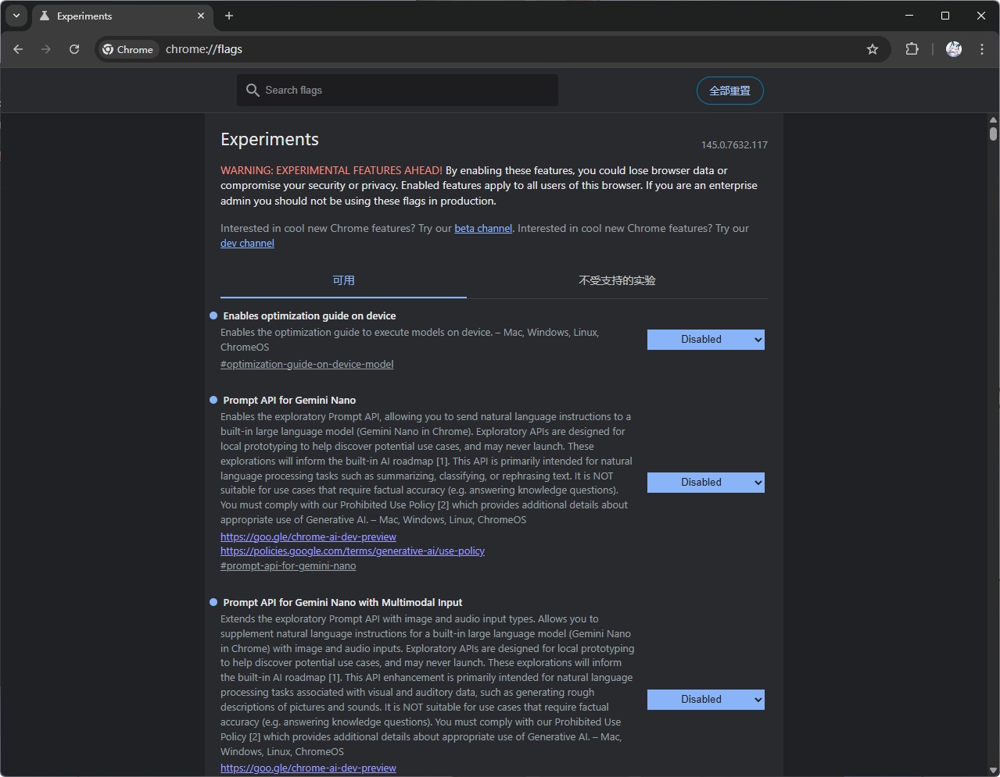
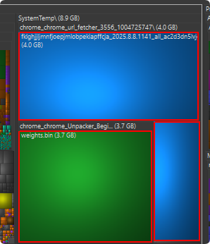

# 教程

打开你的 Chrome ，进入 `chrome://flags`

把 `Enables optimization guide on device` `Prompt API for Gemini Nano` `Prompt API for Gemini Nano with Multimodal Input` 全部改为 `Disabled` 禁用

如果发现你的C盘还是红的

请检查 `C:\Users\你的用户名\AppData\Local\Google\Chrome\User Data\OptGuideOnDeviceModel` 下是不是有个 `weights.bin` ，tm的占用了4GB

如果找不到，说明你的Chrome更新了，请找下面这个目录

`C:\Windows\SystemTemp` 找到 `chrome_chrome_url_fetcher_` 开头的文件夹，里面就是那个大文件

如果这里也没有

找到 `chrome_chrome_Unpacker_Begin` 开头的文件夹，这里也可能会有

> 你妈的谷歌真不当人啊，直接就往C盘拉，你也知道 `OptGuideOnDeviceModel`被我设置权限了拉不了你还改成 `Windows` 目录下，诗人啊？！

# 前言

电脑开机我就感觉很不对劲，怎么一卡一卡的，打开文件资源管理器一看，好家伙，C盘红了，然后打开 `WizTree` 一看：？怎么又是熟悉的4GB左右的文件（之前找C盘垃圾的时候看到过这个大小的文件）

然后我一找，你妈又是谷歌拉了个大模型到我的电脑，有病吗？

默认就是启用的，你以为我电脑空间很多吗？

我真服了，避雷Chrome吧